# zkbuild-action

**Automated TwinCAT CI/CD without Jenkins**: Stop building TwinCAT in the IDE. Get reproducible, tested, automated builds in your GitHub workflow.

zkbuild-action is a GitHub Action that builds, tests, and packages TwinCAT PLCs directly from your repository. No Jenkins/Buildsystem setup. No complex infrastructure. Push code → automatic build + unit tests → artifacts ready to deploy.

## Table of Contents

- [Why You Need This](#why-you-need-this)
- [Quick Start](#quick-start)
- [How It Works](#how-it-works)
- [Configuration](#configuration)
- [Pricing](#pricing)
- [How It Compares](#how-it-compares)
- [Examples](#examples)
- [Troubleshooting](#troubleshooting)
- [Advanced Features: Config with Dependencies](#advanced-features-config-with-dependencies)
- [Advanced Features: Patches](#advanced-features-patches)

## Why You Need This

- **Reproducible builds**: Same output every time, on any machine
- **Automated testing**: Run TcUnit tests in CI; fail the build if tests fail
- **No manual builds**: Eliminate the "forgot to rebuild" and "works on my machine" problems
- **Audit trail**: Every build is logged and traceable (required for compliance)
- **Zero DevOps**: Works with GitHub. No build servers to maintain

### The Problem It Solves

Most TwinCAT engineers build locally in the IDE:
```
1. Engineer writes code in TwinCAT IDE (local machine)
2. Manual testing on hardware
3. Activate to target in the IDE
5. Hope nothing breaks in production
```

This breaks at scale. You need:
- Multiple engineers working on the same code → build conflicts
- Regulatory traceability → manual builds leave no audit trail
- New team members → "how do I build this?" becomes a mystery

zkbuild-action solves this: **Push code → Automated build + tests → Versioned artifacts.**

## Quick Start

**1. Register (Free for Open Source)**:

[Register here](https://zeugwerk.dev/wp-login.php?action=register) to get credentials. You'll receive 30 free builds/month for public repos.

**2. Create a GitHub Workflow**:

Add this file to your repo: `.github/workflows/build.yml`

```yaml
name: Build/Test
on:
  push:
    branches:
      - main
      - 'release/**'
  pull_request_target:
  workflow_dispatch:
jobs:
  Build:
    name: Build/Test
    runs-on: ubuntu-latest
    steps:
      - name: Build
        uses: Zeugwerk/zkbuild-action@1.0.0
        with:
          username: ${{ secrets.ACTIONS_ZGWK_USERNAME }}
          password: ${{ secrets.ACTIONS_ZGWK_PASSWORD }}
      - name: Upload Artifact
        uses: actions/upload-artifact@v4
        with:
          name: artifact
          path: |
            **/*library 
      - name: Publish Unittest
        uses: EnricoMi/publish-unit-test-result-action@v1
        with:
          files: archive/test/TcUnit_xUnit_results.xml
```

3. **Add credentials**: Store your Zeugwerk username/password as GitHub Secrets (don't commit them!)
4. **Push**: Commit this workflow and watch builds run automatically

## How It Works

```mermaid
sequenceDiagram
    participant Dev as Developer
    participant Repo as Git Repository (GitHub)
    participant Action as zkbuild-action (GitHub Action)
    participant CI as Zeugwerk CI/CD

    Dev->>Repo: 🚀 Push commit / create tag
    Repo-->>Action: 🔔 Webhook trigger

    Action->>CI: ⚙️ Start build pipeline

    Note over CI: Zeugwerk CI/CD Pipeline Execution

    CI->>CI: 📝 Generate changelog
    CI->>CI: 🛠️ Build (.library file if needed)
    CI->>CI: 🧪 Run unit tests
    CI->>CI: 📦 Collect Artifacts

    CI-->>Action: 📊 Build artifacts + test reports
    Action-->>Repo: ⬆️ Upload artifacts & reports

    Repo-->>Dev: ✅ Results visible in repository

```





**No Jenkins. No servers. No maintenance.**

## Configuration

### Inputs

| Input | Required | Description |
|---|---|---|
| `username` | Yes | Zeugwerk account username |
| `password` | Yes | Zeugwerk account password |
| `tcversion` | No | TwinCAT version (default: TC3.1) |

### Outputs

| Artifact | Location |
|---|---|
| `.library` file(s) | `archive/<repo>/<tcversion>/<plc_name>_<version>.library` |
| Test results (JUnit XML) | `archive/test/TcUnit_xUnit_results.xml` |
| Build logs | Available in GitHub Actions UI |

### Basic (Single PLC, no dependencies)

Create `.Zeugwerk/config.json` in your repo:

```json
{
  "fileversion": 1,
  "solution": "MyProject.sln",
  "projects": [
    {
      "name": "MyProject",
      "plcs": [
        {
          "name": "MainPLC",
          "version": "1.0.0.0",
          "type": "Library"
        }
      ]
    }
  ]
}
```

(Use [Twinpack](https://github.com/Zeugwerk/Twinpack) to generate this automatically)

### With Unit Tests

zkbuild-action runs unit tests automatically. Two options:

**Option A: Tests in your PLC code (recommended)**
- Implement function blocks that extend `Testbench.IUnittest` **or** for Zeugwerk-Framework users `ZCore.IUnittest`.
- zkbuild automatically finds and runs them
- Requires [ZCore package](https://doc.zeugwerk.dev/) **or** [Testbench](https://github.com/Zeugwerk/Testbench) (do not mix!)

Example:
```iec61131-st
FUNCTION_BLOCK MyFunctionTest EXTENDS MyFunction IMPLEMENTS ZCore.IUnittest

METHOD TestPositiveValue
VAR_INPUT
  assertions : ZCore.IAssertions;
END_VAR

assertions.EqualsDint(42, MyFunction_instance.Calculate(42), 'Test failed');
END_METHOD

END_FUNCTION_BLOCK
```

See [Documentation](https://github.com/Zeugwerk/Testbench?tab=readme-ov-file#write-unittests) for details about the supported method signatures.

**Option B: Separate test project**
- Create a `tests/` folder with a separate `.plcproj`
- Use [TcUnit](https://github.com/tcunit/TcUnit)
- zkbuild runs both projects


## Pricing

- **Free**: 30 builds/month for public repositories
- **Commercial**: Custom pricing for private repos and higher volume. [Contact us](mailto:info@zeugwerk.at)

## How It Compares

| Solution | Setup Time | Cost | Complexity | Includes Tests? |
|---|---|---|---|---|
| Local TwinCAT IDE | 0 | Free | None | No |
| Self-hosted Jenkins | 2-4 weeks | €0-5k + time | High | No (you add it) |
| GitHub Actions (DIY) | 2-4 weeks | €0-5k + time + €0-20/mo | High | No (you add it) |
| **zkbuild-action** | **1 hour** | **Custom** | **Low** | **Yes ✓** |


## Examples

- [struckig](https://github.com/stefanbesler/struckig)
- [DeviceInfo](https://github.com/seehma/DeviceInfo)
- [Pushover-Twincat](https://github.com/stefanbesler/Pushover-Twincat/actions)
- [Demo-Twincat-Application-CI](https://github.com/Zeugwerk/Demo-Twincat-Application-CI)
- [rplc](https://github.com/TcHaxx/rplc)
- See build results, for instance: [struckig Actions tab](https://github.com/stefanbesler/struckig/actions)

## Troubleshooting

**"Build failed: credentials not found"**
- Check that `ZEUGWERK_USERNAME` and `ZEUGWERK_PASSWORD` are set in your GitHub Secrets

**"TwinCAT version mismatch"**
- Use `tcversion: TC3.1.4024` to specify an exact version

**"Tests aren't running"**
- Ensure function blocks implement `Testbench.IUnittest` OR ZCore.IUnittest` OR use a separate `tests/` folder with TcUnit


## Advanced Features: Config with Dependencies

Config with (automatically resolved, downloaded and installed) Dependencies

```json
{
  "fileversion": 1,
  "solution": "TwinCAT Project1.sln",
  "projects": [
    {
      "name": "TwinCAT Project1",
      "plcs": [
        {
          "version": "1.0.0.0",
          "name": "Untitled1",
          "type": "Library",
          "packages": [
            {
              "version": "1.2.19.0",
              "repository": "bot",
              "name": "ZCore",
              "branch": "release/1.2",
              "target": "TC3.1",
              "configuration": "Distribution",
              "distributor-name": "Zeugwerk GmbH"
            }
          ],
          "references": {
            "*": [
              "Tc2_Standard=*",
              "Tc2_System=*",
              "Tc3_Module=*"
            ]
          }
        }
      ]
    }
  ]
}
```

## Advanced Features: Patches

Zeugwerk CI supports to apply patches to the source code of the repository, which are applied before compiling the code.
At the moment the following types of patches are supported
- `Platform patches`: are applied for specific TwinCAT Versions
- `Argument patches`: can be used for feature flags. At the moment this feature is not enabled for the free-to-use zkbuild, if you are interested in using it for your open source project, you may submit an [issue](https://github.com/Zeugwerk/zkbuild-action/issues).
  
To use patches, a `config.json` file has to be used and patches have to be configured in the configuration file as follows

```jsonc
{
  "fileversion": 1,
  "solution": "TwinCAT Project1.sln",
  "projects": [
    {
      "name": "TwinCAT Project1",
      "plcs": [
        {
          ...
          "name": "Untitled1",
          "patches":
            "platform": {
              "TC3.1.4024.56": [
                "git-patch-for-specific-twincat-version.patch",
                "search-and-replace.for-specific-twincat-version.replacement"
              ]
            },
            "argument": {
              "": [
                "git-patch.patch",
                "search-and-replace.replacement"
              ]
            },
          ...
        }
      ]
    }
  ]
}
```

### Git patches
Any file with the extension `.patch` is [applied as a Git patch](https://git-scm.com/docs/git-apply). You can use `git diff > some-changes.patch` to create the patch and the CI system, will use `git apply -3 some-changes.patch` to apply the patch. If the patch can not be applied correctly, the pipeline will go to failure.

### Search-and-replace patch
We support a mechanismn to do search-and-replace over many files in the source code before it is compiled. This is simpler than using a proper git patch. A replacement patch is a json file, which has the following format and has the file extension `.replacement`

```jsonc
{
  "filter": "*.TcPOU",
  "search": "pattern",
  "replace": "replacement"
}
```

- `filter` can be used to filter for specific files, the examples filters for all POUs in the source code
- `search` is a the regular expression pattern to match, special characters have to be escaped
- `replace` is the replacement string, which may contain identifiers to refer to captures of the regex (`$1` ... `$N`). It is also possible to use enviornment variables here. Zeugwerk CI uses Jenkins, enviornment variables can be referred to with `{{env.ENVIORNMENT_VARIABLE}}`. See [here](https://devopsqa.wordpress.com/2019/11/19/list-of-available-jenkins-environment-variables/) for a list of possible enviornmemt variables.
